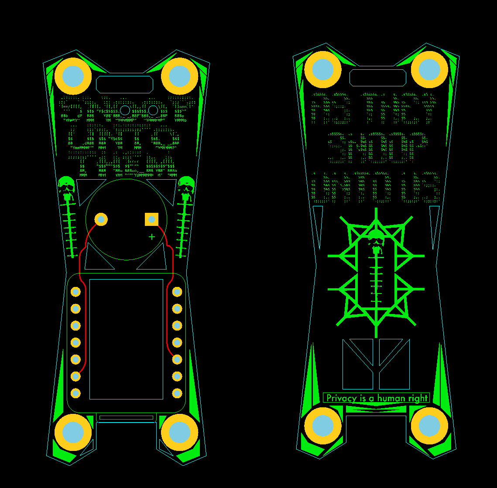

# OUI-SPY - Detector (Dual Domain Edition)



Professional dual-domain (BLE + WiFi) scanning system that detects specific devices by MAC address or OUI with audio feedback. BLE advertisements and 802.11 management frames (probe requests / beacons) are detected on the shared 2.4 GHz radio via time-sliced scanning.

## Flash from your browser

No Python, no PlatformIO, no drivers to install:

**https://colonelpanichacks.github.io/ouispy-detector/**

Chrome, Edge, or Opera on desktop. Plug in the XIAO ESP32-S3 with a USB-C data cable, click **Connect & Flash**, pick the serial port. Always ships the latest committed `src/detector.bin`.

## Hardware

**OUI-SPY Board** - Available on [colonelpanic.tech](https://colonelpanic.tech)
- ESP32-S3 based detection system
- Integrated buzzer and power management
- Ready-to-use, no additional components required

**Alternative:** Standard ESP32-S3 with external buzzer on GPIO3

**Enhanced Version:** Same firmware, add NeoPixel LED for visual feedback
- Buzzer: GPIO3 (D2)
- NeoPixel: GPIO4 (D3)
- **Note:** One firmware supports both configurations automatically

## Quick Start

1. **Power on device** - Creates WiFi AP `snoopuntothem` (password: `astheysnoopuntous`)
2. **Connect and configure** - Navigate to `http://192.168.4.1`
3. **Add targets** - Enter OUI prefixes (`AA:BB:CC`), full MAC addresses, or click vendor presets in the OUI Database
4. **Save configuration** - Device automatically switches to scanning mode

## Features

### MQTT / Home Assistant Integration
- Publishes detections to any MQTT broker (Mosquitto, etc.)
- Auto-discovery: OUI Spy appears as a device in Home Assistant automatically
- Detection blips: sensor shows MAC on detection, returns to "idle" after 10 seconds of silence
- WiFi STA connection if alert is detected.
- Configurable broker, port, credentials, and topic from the web UI
- No external libraries required (raw MQTT over TCP)
- Clean socket teardown: MQTT disconnect packet sent before STA is dropped, so the broker sees an orderly disconnect rather than a timed-out session

### Detection System
- **Dual-domain time-slicing:** The 2.4 GHz radio alternates between WiFi promiscuous sweeps (channels 11→1, 200 ms dwell, ~2.2 s) and BLE active scans (~2.2 s). Each domain runs only if at least one filter of that type is configured; with no filters at all the device idles.
- **WiFi promiscuous detection:** Matches the source OUI of 802.11 management frames — probe requests (subtype 0x04) and beacons (subtype 0x08) — with per-(MAC, frame type) 30 s de-duplication.
- **Fast-path OUI pre-check:** A small lookup table of target OUIs is maintained in RAM and rebuilt whenever WiFi filters change. The promiscuous callback drops non-matching frames before doing the full filter comparison, keeping the ISR path lightweight.
- **Ring-buffer detection queue:** Both the WiFi promiscuous ISR and the BLE callback enqueue detections into a fixed ring. The main loop drains it, handles audio/visual alerts, publishes to MQTT, and writes session data. This prevents back-to-back hits from different devices from overwriting each other.
- **One-click vendor signatures:** Add every known signal for a device family from the OUI Database — OUIs, company IDs, service UUIDs, and WiFi probe/beacon signatures in a single click.
- OUI filtering for device manufacturers (BLE and WiFi)
- Full MAC address matching
- Persistent configuration storage in NVS (survives reboots)

### Audio & Visual Feedback
- **Audio:** 2 ascending beeps (ready), 3 beeps (new detection or 30 s re-alert), 2 beeps (3 s re-alert)
- **Visual:** Pink breathing LED during scanning, blue → pink → purple flash on detection
- **Synchronized:** LED flashes match beep timing
- Smart cooldown prevents spam
- All alerts are driven from the main loop, not from ISR context, so the radio stacks stay stable

### Privacy
- MAC address randomization on boot — both the WiFi MAC and the BLE-origin MAC (the BT DMAC is derived from the same base MAC, so one `esp_wifi_set_mac()` call randomizes both). Disabled when MQTT is enabled so the DHCP lease stays stable.
- Stealth mode operation
- No traceable hardware fingerprints

### Device Management
- **Device Aliasing:** Assign custom names to detected devices via the web portal
- **Persistent History:** All detected devices saved to NVS (up to 100 devices)
- **Automatic Sync:** Device list updates across reboots
- **Clear History:** Remove all stored device records
### Burn In Settings
- **Permanent Lock:** Lock configuration and bypass setup on boot
- **Instant Scanning:** Device boots directly into scanning mode
- **Protected Settings:** All filters, aliases, and preferences preserved
- **Reversible:** Hold the BOOT button 1.5 seconds to clear the lock and reboot into config mode


## Installation

### Prerequisites

Install PlatformIO in a Python virtual environment using the pinned requirements:

```bash
python3 -m venv .venv
source .venv/bin/activate
pip install -r requirements.txt
```

This gives you `pio` (PlatformIO CLI) with a known-good version of the toolchain.

### Build and Flash

From the repository root:

```bash
source .venv/bin/activate
pio run -e seeed_xiao_esp32s3 -t upload
```

### Open Serial Monitor

```bash
pio device monitor -b 115200
```

The firmware expects the XIAO ESP32-S3's USB-CDC serial port to enumerate as a `/dev/ttyACM*` device on Linux. If it doesn't appear, hold the BOOT button while plugging in to force download mode, then flash again.

### Dependencies

Defined in `platformio.ini`; fetched automatically by PlatformIO on first build:

- NimBLE-Arduino ^1.4.0 (BLE scanning)
- ESP Async WebServer ^3.0.6 (config portal)
- Adafruit NeoPixel ^1.12.0 (LED)
- ArduinoJson ^6.21.0 (session persistence)
- Arduino core 3.3.12 / ESP-IDF v5.5.5 (pinned in `platform_packages` for promiscuous-mode buffer support)

## Configuration

### Web Portal

Access via `http://192.168.4.1` after connecting to the `snoopuntothem` AP.

**Filter entry:** Type an OUI prefix (`AA:BB:CC`) or full MAC (`AA:BB:CC:12:34:56`) into the filter input, toggle the BLE and/or WiFi badges to select domains, and press **Add Filter**. The row appears with domain badges that can be toggled by clicking them; saving writes the list to NVS.

**Vendor presets:** Below the filter list is the OUI Database — a browsable set of known surveillance-hardware vendors. Each card shows the vendor's BLE signatures (OUI prefixes, and where applicable company IDs / service UUIDs / name patterns) plus WiFi probe/beacon signatures. Click **+ Add** to install all signatures for that vendor in one go. Presets merge into the same unified filter list as manual entries — the row shows the vendor label and the domain badges indicate which radios the signature listens on.

Saved filters persist across reboots. After a reboot into config mode the filter list renders exactly as it was saved, including domain badges.

### Filter Types

Eight signature classes across two domains, all rendered as rows in the unified filter list:

| Type | Domain | Matches on | Example |
|---|---|---|---|
| **OUI** | BLE | First 3 bytes of the advertising MAC | `00:25:DF` |
| **MAC** | BLE | Complete 6-byte address | `00:25:DF:12:34:56` |
| **CID** | BLE | BT SIG manufacturer company ID in advert payload | `0x034D` |
| **SVC** | BLE | 16-bit BLE service UUID | `0xFC81` |
| **NAME** | BLE | Case-insensitive substring of the device name | `Ray-Ban` |
| **META** | BLE | Composite: CID `0x0D53` + svc `0xFD5F` in same advert, or name `Ray-Ban`/`Wayfarer`/`Oakley Meta` | META / RAY-BAN preset |
| **PROBE** | WiFi | Probe request from a target OUI | `00:25:DF` |
| **BEACON** | WiFi | Beacon frame from a target OUI | `00:25:DF` |

### OUI Database

The database is maintained in two source files: [`BLEOUIs.md`](BLEOUIs.md) (BLE signatures) and [`WiFiOUIs.md`](WiFiOUIs.md) (WiFi probe/beacon signatures). The sync scripts [`sync-oui-list.py`](sync-oui-list.py) and [`sync-wifi-oui-list.py`](sync-wifi-oui-list.py) regenerate the OUI Database section of the HTML between the `OUI_DB_START`/`OUI_DB_END` markers in `src/main.cpp`.

Run from the repo root after editing either `.md` file:

```bash
source .venv/bin/activate
python sync-oui-list.py
python sync-wifi-oui-list.py
```

### NeoPixel Wiring (Optional Enhancement)

```
ESP32-S3 Xiao    →    NeoPixel
─────────────────────────────────
GPIO4 (D3)       →    Data Input (DIN)
3.3V             →    VCC (Power)
GND              →    GND (Ground)
```

- **Normal scanning:** pink breathing animation
- **Detection:** blue → pink → purple flash, matched to the beep timing
- **Brightness:** 50/255 breathing, 200/255 detection flash

## MQTT Setup (Home Assistant)

1. On the config portal, scroll to **MQTT** and fill in your home WiFi SSID/password, broker IP/port, optional credentials, and topic.
2. Save. How the STA is used depends on the installed filters:
   - **BLE-only filters:** STA stays up the whole time — MQTT connects once and reports every detection live, exactly like single-domain firmware.
   - **BLE + WiFi filters:** promiscuous sweeps own the radio, so detections queue up and flush during the next BLE phase: STA comes up in a bounded report window, publishes everything queued, sends an MQTT DISCONNECT, and tearing down before the sweep resumes. Expected blind window per batch: ~2–12 s.
   - **WiFi-only filters:** no BLE phase ever opens a report window, so detections are **not** reported over MQTT (the device logs this on serial at scanning start). Use at least one BLE filter if you need reporting.
3. Home Assistant auto-registers an OUI Spy device via MQTT discovery — no `configuration.yaml` edits needed.
4. Payload example:

```json
{"mac":"aa:bb:cc:dd:ee:ff","alias":"my-device","rssi":-65,"type":"PROBE","match":"0025DF","desc":"AXON (WiFi)"}
```

## Operation

### Startup Sequence

1. Load MQTT config; randomize MAC unless MQTT is enabled
2. Load saved filters, aliases, and device history from NVS
3. If burned in, boot straight to scanning mode
4. Otherwise start config mode (AP + web portal) and stay there until the user saves
5. If both WiFi and BLE filters exist, alternate radio phases; if only one domain has filters, run just that domain; if none, idle

### Detection Logic

- **Time-sliced dual-domain scanning:** the shared 2.4 GHz radio alternates between a WiFi promiscuous sweep (channels 11→1, 200 ms dwell, ~2.2 s) and a BLE active scan (2 s), WiFi first.
- **Domain skip logic:** no BLE filters → BLE phases skipped; no WiFi filters → WiFi phases skipped; neither → idle.
- **WiFi matching:** the promiscuous callback drops every non-management frame and every management frame whose source OUI is not in the fast-path table, before spending any cycles on the full filter match.
- **BLE matching:** real-time OUI/MAC/CID/UUID/name matching against advertisements in the NimBLE callback.
- **Ring-buffer handoff:** both producer callbacks push a fixed-size `DetectionEntry` into a ring; the main loop drains it and drives the buzzer, LED, and MQTT publish. Beeps and flash are *not* called from the ISR context.
- **De-duplication:** per (MAC, frame type) 30 s cooldown suppresses beacon-flood re-alerts; 3 s re-alert timer for repeat sightings.
- **STA report:** with WiFi filters installed, detections that land during sweeps queue as JSON payloads and flush in one bounded report window during the next BLE phase (STA up → publish all → MQTT DISCONNECT → STA down → sweep resumes). BLE-only configs publish directly because STA never drops.

## Serial Output

```
=== OUI Spy Enhanced BLE Detector ===
Original MAC: d8:3b:da:45:aa:a0
Randomized MAC: a2:f3:91:7e:8c:45

Loading configuration...
Device aliases loaded from NVS (3 aliases)

=== STARTING SCANNING MODE ===
Configured Filters:
- D42DC5 (OUI): I-PRO body cam (BLE OUI)
- D42DC5 (PROBE): I-PRO body cam (WiFi probe)

>> Match found! <<
{"mac":"d4:2d:c5:ab:cd:ef","alias":"","rssi":-65,"type":"PROBE","match":"D42DC5","desc":"I-PRO body cam (WiFi probe)"}
```

## Troubleshooting

- **No WiFi AP:** Wait a few seconds after power-on; if the device is burned in it skips config mode entirely (hold BOOT 1.5 s to unlock)
- **No web portal:** Ensure connected to `snoopuntothem`; disable mobile data if the phone keeps roaming off the AP
- **No audio:** Check `buzzerEnabled` was not previously cleared by an early firmware version — re-save the config to restore
- **No LED:** Check NeoPixel wiring (GPIO4, 3.3V, GND)
- **WiFi detections not firing:** Verify the source OUI is installed as a `PROBE` or `BEACON` filter; the WiFi fast-path table is built from those, so a bare BLE `OUI` filter does not enable WiFi matching
- **Can't unlock burned config:** Hold BOOT 1.5 s during power-on or while running; erase flash as a last resort (`pio run -e seeed_xiao_esp32s3 -t erase`)

## Technical Specifications

- **Platform:** ESP32-S3 (XIAO ESP32-S3 reference board)
- **Radio:** Shared 2.4 GHz radio, software coexistence enabled
- **Scan cycle:** ~4.2 s time-slice (2.2 s WiFi sweep + 2.0 s BLE scan)
- **WiFi sweep:** channels 11→1, 200 ms dwell per channel, management frames only
- **Range:** 10–30 m typical.
- **Storage:** NVS for filters/aliases/history
- **Device history:** Up to 100 devices persisted in NVS
- **Audio:** GPIO3 buzzer with LEDC PWM + bit-banged fallback
- **Visual:** GPIO4 NeoPixel

## OUI-SPY Firmware Ecosystem

OUI-SPY Detector is part of the OUI-SPY firmware family:

| Firmware | Description | Board |
|----------|-------------|-------|
| **[OUI-SPY Unified](https://github.com/colonelpanichacks/oui-spy-unified-blue)** | Multi-mode BLE + WiFi detector | ESP32-S3 / ESP32-C5 |
| **[OUI-SPY Detector](https://github.com/colonelpanichacks/ouispy-detector)** | Targeted dual-domain scanner with OUI filtering (this project) | ESP32-S3 |
| **[OUI-SPY Foxhunter](https://github.com/colonelpanichacks/ouispy-foxhunter)** | RSSI-based proximity tracker | ESP32-S3 |
| **[Flock You](https://github.com/colonelpanichacks/flock-you)** | Flock Safety / Raven surveillance detection | ESP32-S3 |
| **[Sky-Spy](https://github.com/colonelpanichacks/Sky-Spy)** | Drone Remote ID detection | ESP32-S3 / ESP32-C5 |
| **[Remote-ID-Spoofer](https://github.com/colonelpanichacks/Remote-ID-Spoofer)** | WiFi Remote ID spoofer & simulator with swarm mode | ESP32-S3 |
| **[OUI-SPY UniPwn](https://github.com/colonelpanichacks/Oui-Spy-UniPwn)** | Unitree robot exploitation system | ESP32-S3 |

## License

Open source project. Modifications welcome.
